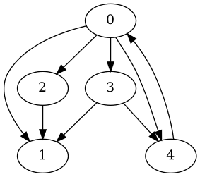

# 🧠 STRUCTURE DE DONNÉES : GRAPHE

## 🎯 Objectif

Approfondir la compréhension des **structures de données**, en particulier les **graphes**, et apprendre à les visualiser à l’aide d’outils comme **Graphviz**.

---

## 🛠️ Installation de Graphviz

Sur une distribution Linux basée sur Debian (ex : Ubuntu), installe Graphviz avec la commande suivante :

```bash
sudo apt update
sudo apt install graphviz
```

---

## 🖼️ Générer une image à partir d’un fichier `.dot`

Utilise cette commande pour convertir un fichier `.dot` en image `.png` :

```bash
dot -Tpng graph.dot -o graph.png
```

---

## 📌 Aperçu du graphe généré

Voici une image générée à partir de `graph.dot` :


